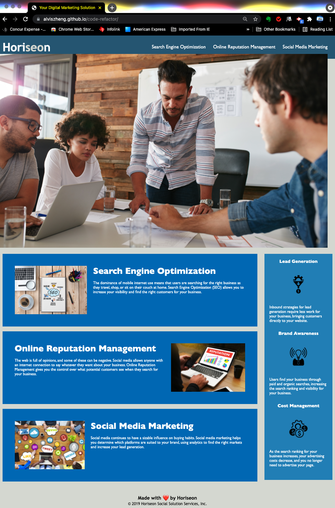

# Code Refactor

One of the most common tasks for front-end and junior developers is to take existing code and refactor it to either meet a certain set of standards or implement a new technology. Web accessibility is an increasingly important consideration for businesses, ensuring that people with disabilities and/or socio-economic restrictions have access to their website. Accessible websites are better optimized for search engines, and help companies avoid litigation.

## Objective

* Website meets accessibility standards
* HTML code follows semantic HTML elements
* HTML elements follow a logical structure independent of styling and positioning
* HTML code use alt attributes for accessibility
* HTML heading attributes in sequential order
* HTML title element is concise and descriptive

## Description

## Github deployment

* Github repository URL: https://github.com/alviszheng/code-refactor
* Github page URL: https://alviszheng.github.io/code-refactor/

## Support

Contact <a href="mailto:alviszheng@hotmail"> alviszheng@hotmail.com /a> if you need anything

## Review

You are required to submit the following for review:

* The URL of the deployed application.

* The URL of the GitHub repository. Give the repository a unique name and include a professional README describing the project.

- - -
© 2021 Trilogy Education Services, LLC, a 2U, Inc. brand. Confidential and Proprietary. All Rights Reserved.
